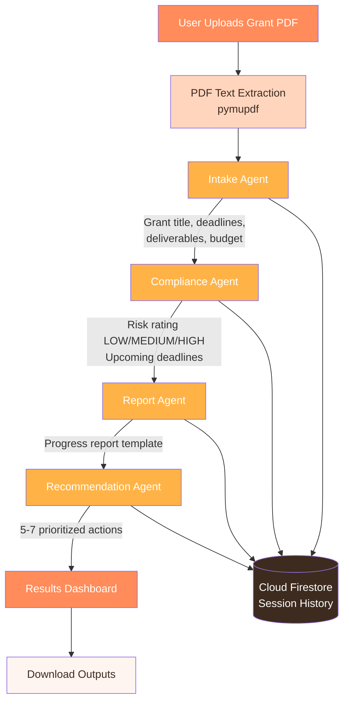

# Grant Compliance Monitor

An AI-powered grant compliance analysis tool that reads awarded grant documents, identifies compliance risks, generates progress report templates, and provides actionable recommendations - built with Google ADK, Vertex AI, and Cloud Firestore for persistent session storage.

## Live URL
[https://grant-compliance-monitor-372084505086.us-central1.run.app](https://grant-compliance-monitor-372084505086.us-central1.run.app)

---

## Architecture



---

## Tech Stack

| Layer | Technology |
|---|---|
| Agent Framework | Google ADK (Agent Development Kit) |
| LLM | Gemini 2.5 Flash |
| Model Hosting | Vertex AI (GCP) |
| Session Storage | Cloud Firestore |
| PDF Extraction | PyMuPDF (fitz) |
| Web Framework | Flask |
| Containerization | Docker |
| Deployment | Google Cloud Run |
| Version Control | GitHub |

---

## How It Works

The app uses a **SequentialAgent pipeline** where 4 specialized agents work in order:

**1. Intake Agent**
Reads the full grant PDF and extracts all critical information - grant title, funding agency, award amount, project dates, reporting deadlines, deliverables, milestones, budget categories, and compliance requirements.

**2. Compliance Agent**
Acts as a compliance officer - identifying the top 5 compliance risks, flagging deadlines in the next 30/60/90 days, and rating overall compliance risk as **LOW**, **MEDIUM**, or **HIGH**.

**3. Report Agent**
Drafts a professional progress report template ready for submission to the funding agency - with sections for Executive Summary, Milestones Achieved, Budget Status, Upcoming Deadlines, and Risk Mitigation.

**4. Recommendation Agent**
Provides 5-7 specific, actionable recommendations prioritized by urgency (immediate, short-term, long-term) with risk mitigation strategies.

### Session History with Firestore
Every analysis is automatically saved to **Cloud Firestore** with a unique Session ID, enabling persistent history across requests - directly addressing the stateless nature of Cloud Run.

---

##  Why This Project

Post-award compliance is a real pain point for research institutions managing multiple active grants simultaneously, each with unique reporting requirements and deadlines.

---

##  Run Locally

### Prerequisites
- Python 3.13+
- Google Cloud account with Vertex AI and Firestore enabled
- A grant document in PDF format

### Steps

```bash
# Clone the repo
git clone https://github.com/orangebirbb/grant-compliance-monitor.git
cd grant-compliance-monitor

# Create virtual environment
python3 -m venv .venv
source .venv/bin/activate

# Install dependencies
pip install -r requirements.txt

# Authenticate with GCP
gcloud auth application-default login

# Enable required APIs
gcloud services enable aiplatform.googleapis.com firestore.googleapis.com

# Run the app
python3 app.py
```

Then open **http://localhost:8080** in your browser and upload a grant PDF.

---

##  Deploy to Cloud Run

```bash
# Build for AMD64
docker buildx build --platform linux/amd64 \
  -t gcr.io/YOUR_PROJECT/grant-compliance-monitor --push .

# Deploy
gcloud run deploy grant-compliance-monitor \
  --image gcr.io/YOUR_PROJECT/grant-compliance-monitor \
  --platform managed \
  --region us-central1 \
  --allow-unauthenticated \
  --set-env-vars GOOGLE_CLOUD_PROJECT=YOUR_PROJECT,\
GOOGLE_CLOUD_LOCATION=us-central1,\
GOOGLE_GENAI_USE_VERTEXAI=true
```

---

## Project Structure

```
grant-compliance-monitor/
├── app.py              # Flask web app + HTML UI
├── agent.py            # 4-agent pipeline + Firestore integration
├── requirements.txt    # Dependencies
├── Dockerfile          # Container config
├── .dockerignore       # Docker ignore rules
└── tests/
    └── test_ui.py      # Selenium test suite
```

---

## Author

**Sruthi Barigela**
[GitHub](https://github.com/orangebirbb) • [LinkedIn](https://linkedin.com/in/sruthibarigela)
